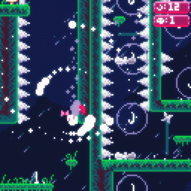

# MOON QUEST

## Description:
MoonQuest is a PICO8 platformer inspired by some of my favorite games such as Super Mario World, Super Meat Boy, and Celeste! You have to collect all the moons!

## How to play:

### Option 1 - Online
Simply go to https://1z1gh0st.itch.io/moon-quest and start playing right in your browser!
### Option 2 - Download
Clone or download this repository, navigate to its folder in the PICO-8 console and then type `load moonquest.p8` then `ctrl - r`/`cmd - r`.
This game is not yet on the splore page, but I will do that once the game is completed.

## Guide:
PICO-8 has 6 main inputs, the arrow keys and two other inputs, which are typically bound to 'z' and 'x'. Use the arrow keys to move and press 'x' to jump, 'z' interacts with things like blocks and signs.

`made with <3 by gh0st.lv :3`

## License:
This project uses a GNU GPL-v3 license.

